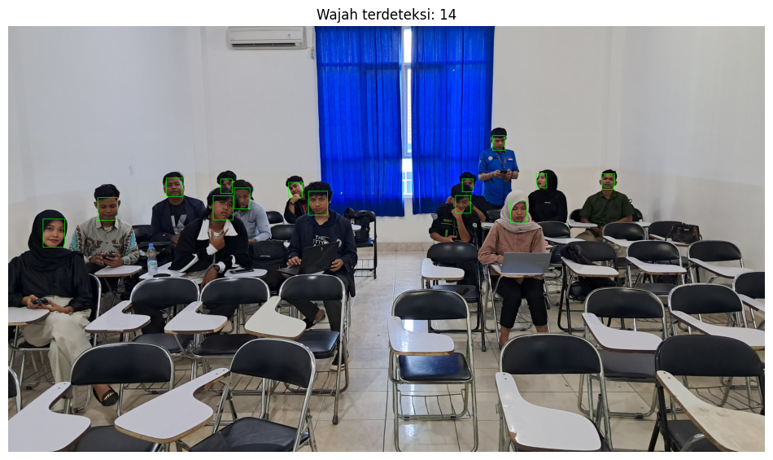
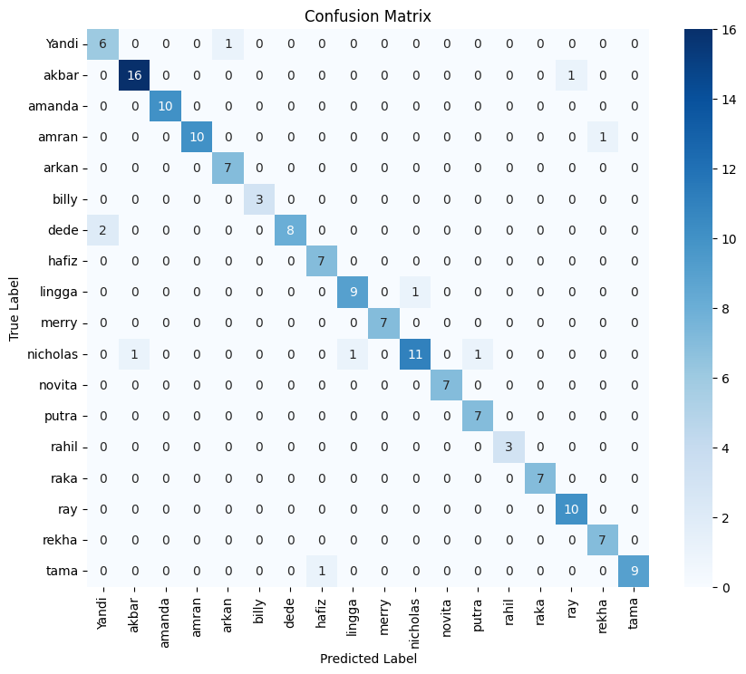
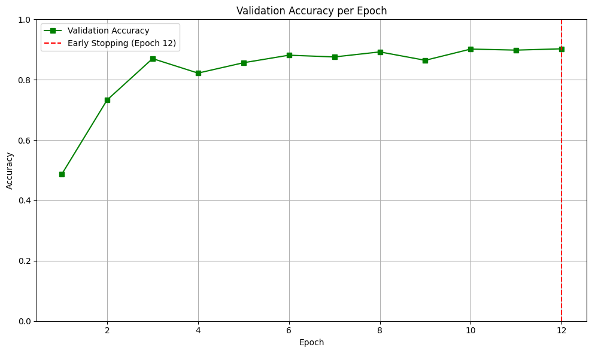
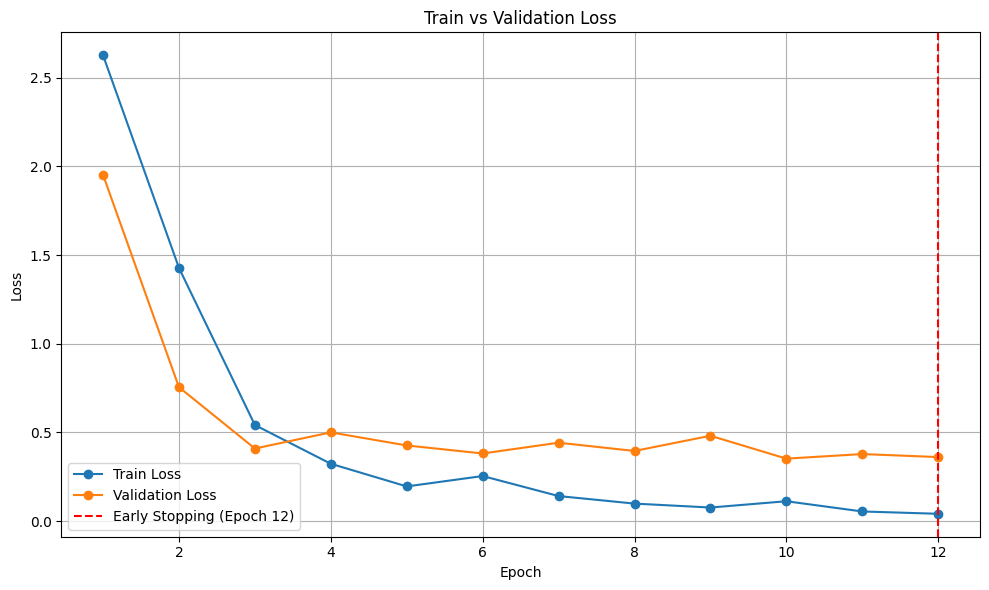

## Real-time Classroom Attendance System using Face Recognition

  
  
  
  
  

The rapid advancement of digital technology has encouraged the adoption of intelligent systems in various fields, including education. One important activity in academic institutions is attendance recording, which traditionally relies on manual methods. With the increasing availability of computer vision and deep learning techniques, face recognition has become a promising solution for automating attendance systems. By leveraging deep learning models, facial features can be accurately identified and used to record attendance efficiently.

### Table of Contents

- [Dataset](#dataset)
- [Libraries](#libraries)
- [Data Augmentation](#data-augmentation)
- [Models](#models)
- [Results](#results)

### Dataset
The dataset used in this project consists of facial images of university students, organized into 17 classes, where each class represents one student.

- Data type: Face images
- Total classes: 17 students
- Image format: RGB
- Dataset structure: One folder per student (class)

### Libraries
The system is developed using the following Python libraries:

<pre>
import os
import copy
import numpy as np
import matplotlib.pyplot as plt
import seaborn as sns
from tqdm import tqdm
import torch
import torch.nn as nn
import torch.optim as optim
from torch.utils.data import DataLoader, Subset
from torchvision import datasets, transforms, models
from facenet_pytorch import MTCNN
import cv2
from PIL import Image
from sklearn.model_selection import train_test_split
from sklearn.metrics import accuracy_score, classification_report, confusion_matrix
</pre>

### Data Augmentation
To improve model generalization and reduce overfitting, several data augmentation techniques were applied:

- Cropping
Each image is cropped into 4 regions:
  - Top
  - Bottom
  - Left
  - Right
- Brightness Adjustment
Generates 4 variations:
  - 2 brighter images
  - 2 darker images
- Resolution Reduction
Generates 3 variations with reduced image resolution to simulate low-quality camera input.
- Gaussian Blur
Generates 5 blurred variations to improve robustness against motion blur and focus issues.

### Models 
Two deep learning architectures are used in this system:
- VGG16
- VGGFace

### Results

